# A2SV AI FOR AFRICA'S HACKATHON


## Project: Estimenet

### Objective
The primary aim of this project is to develop an AI-powered system that predicts diabetes and estimates the insulin dosage required for diagnosed diabetic patients. By leveraging machine learning techniques and comprehensive datasets, the project seeks to enhance diabetes management strategies.

### Key Features
- **Diabetes Prediction**: Utilizes the Gradient Boosting Classifier to predict the presence of diabetes.
- **Insulin Dosage Estimation**: Uses Linear Regression to estimate the appropriate insulin dosage for diabetic patients.
- **Comprehensive Data Analysis**: Integrates datasets from the PIMA diabetes dataset and the UCI insulin dosage dataset.
- **User-Friendly Interface**: Provides a seamless experience for healthcare providers to manage patient data and predictions.

### Technology Stack
- **Backend**: Python, Django Rest Framework, PostgreSQL
- **Frontend**: React, Redux, HTML, CSS
- **AI Frameworks**: TensorFlow, PyTorch
- **Version Control**: Git, GitHub

### Methodology
In this project, we adopt a two-step approach for predicting diabetes and estimating insulin dosage in diagnosed diabetic patients:

1. **Diabetes Prediction**:
   - A Gradient Boosting Classifier is employed to predict the presence of diabetes using the PIMA diabetes dataset, which is designed for diagnostic prediction based on specific measurements.

2. **Insulin Dosage Estimation**:
   - Concurrently, a Linear Regression algorithm is utilized to estimate insulin dosage using the UCI insulin dosage dataset, a comprehensive collection of databases essential for empirical analysis in the machine learning domain.

Following the training phase with these datasets, we test our models by uploading a dataset without class labels. The Gradient Boosting Classifier predicts the presence of diabetes, and for those diagnosed, the Linear Regression model estimates the appropriate insulin dosage. This method enables us to leverage both datasets effectively for accurate diabetes prediction and insulin dosage estimation.

### Installation

1. **Clone the repository**:
   ```bash
   git clone git@github.com:Ammen1/estimeten.git
   cd estimeten
   
Project Status
This project is currently under development and is in its early stages. While some features are functional, there is still a lot of work to be done. We appreciate your interest and patience as we continue to improve and expand the capabilities of the system.

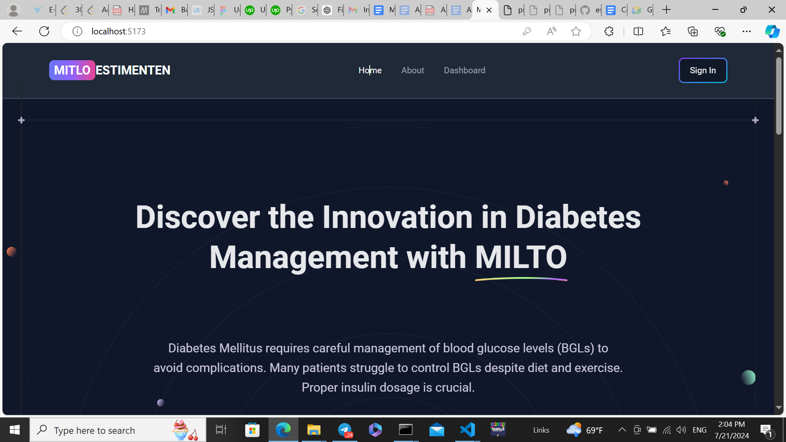

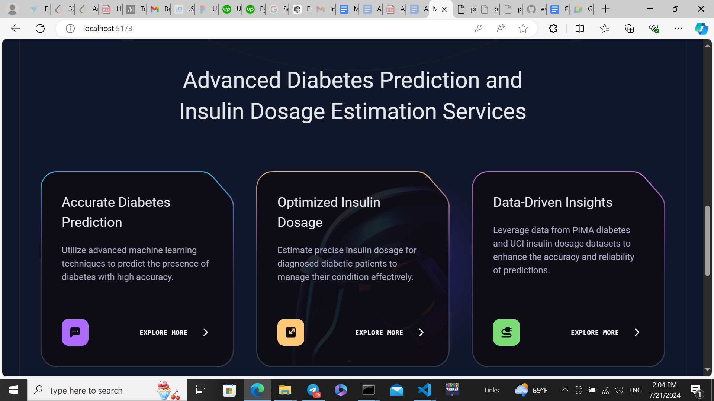
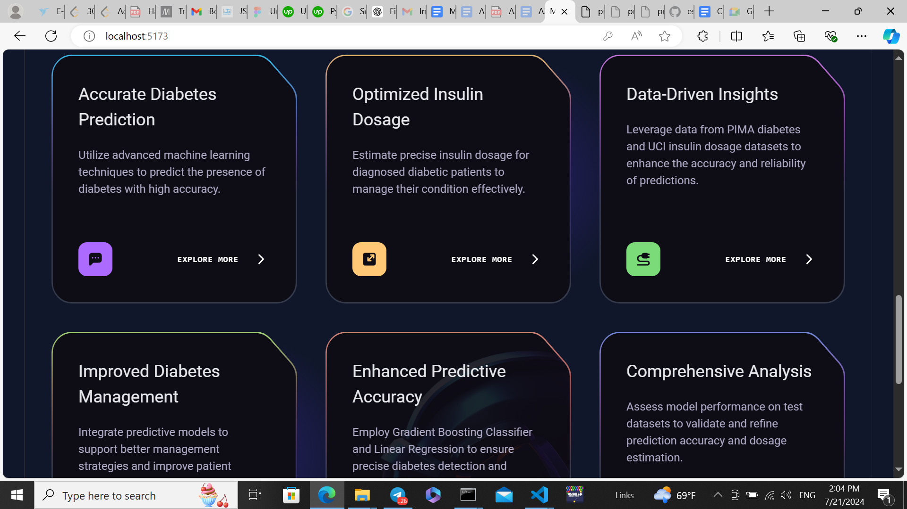
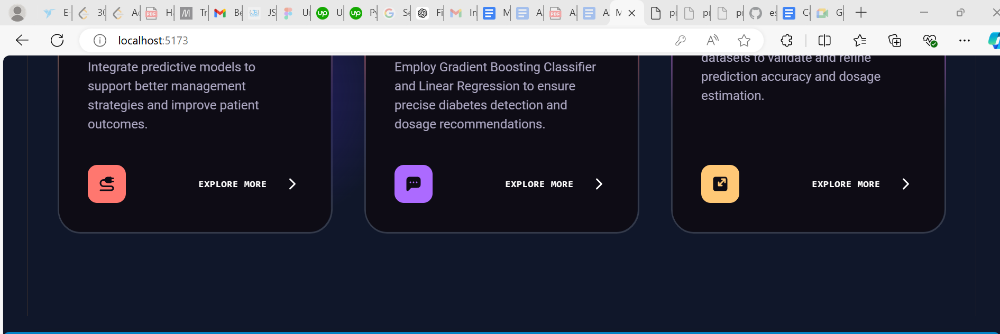
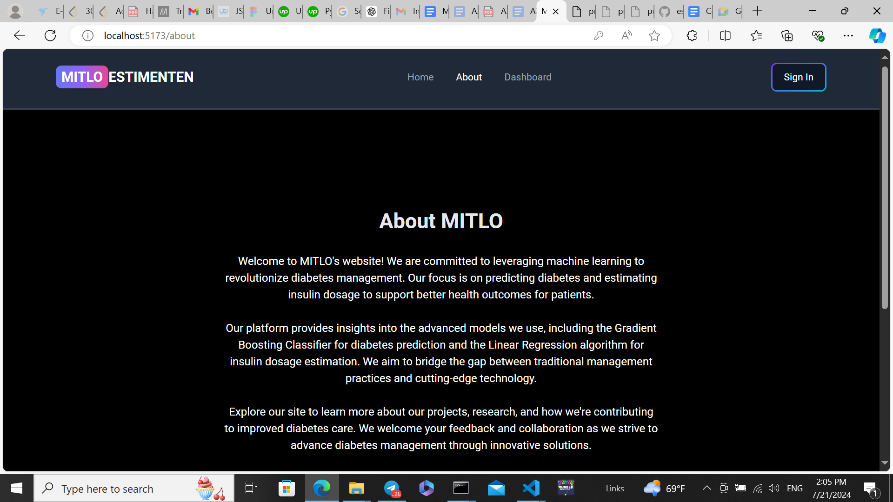
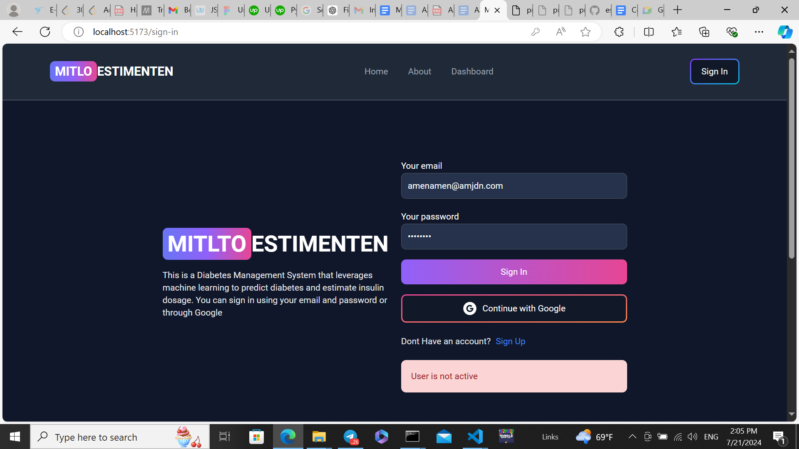
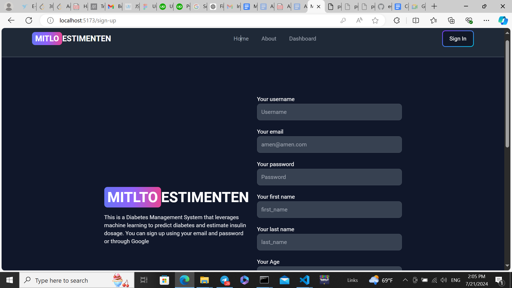
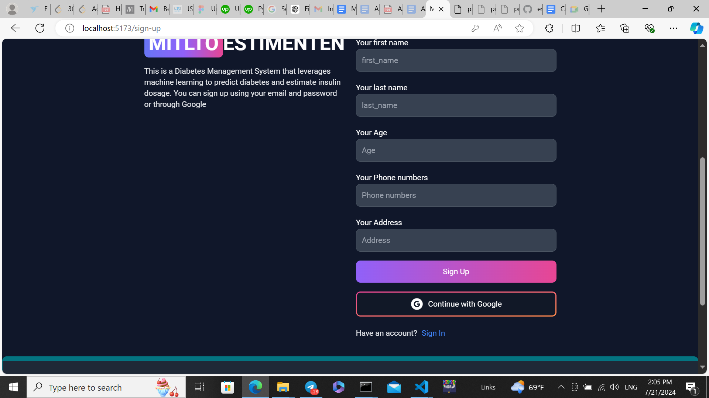
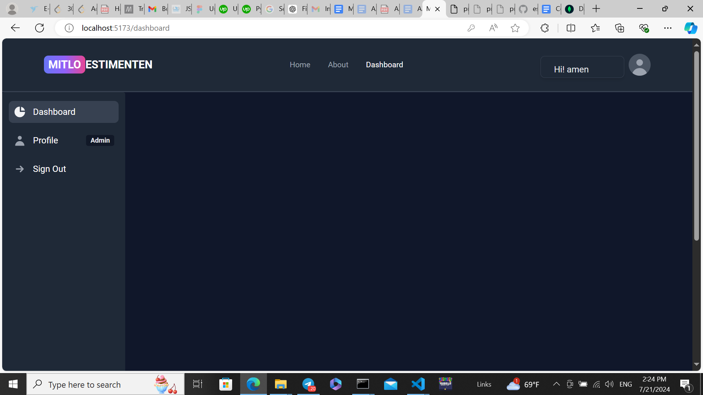
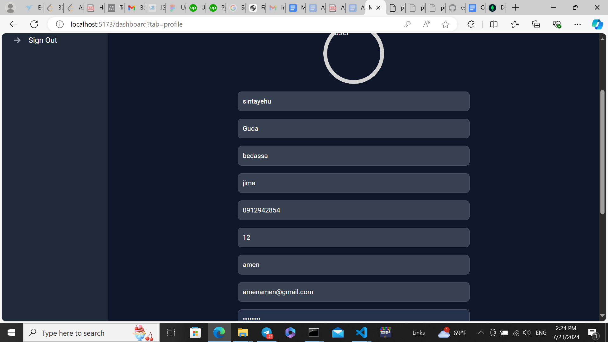
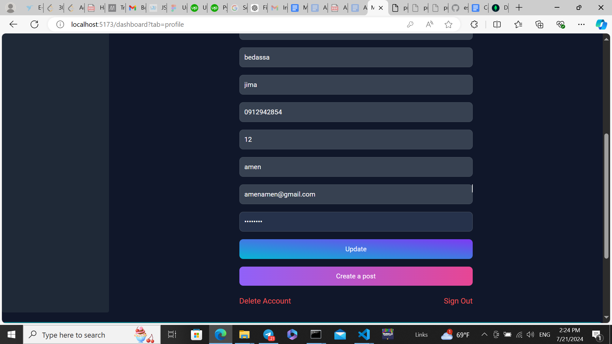
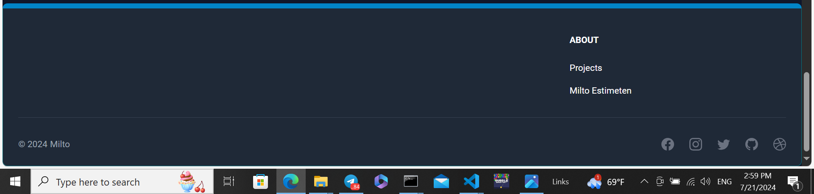
